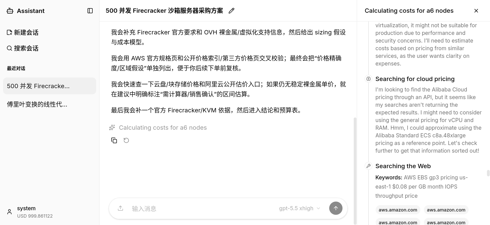
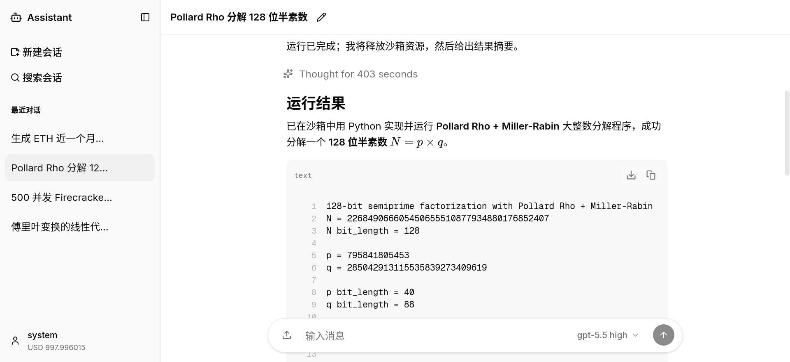
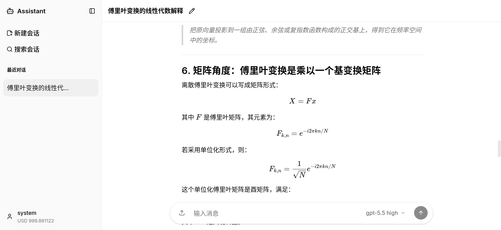
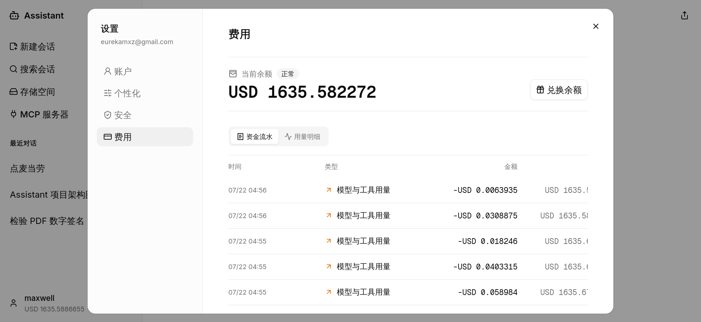

# assistant

Agentic AI 对话助手，基于 OpenAI Responses API，支持网络搜索、文件理解、图片生成，以及基于 microVM 沙箱的不受信任命令安全执行。

## 功能展示

点击截图可查看原图。

<table>
  <tr>
    <td width="50%" valign="top">
      <a href="./assets/websearch.png">
        
      </a>
      <br />
      <strong>联网检索与执行时间线</strong>
      <br />
      <sub>在对话中持续反馈检索进度，并通过时间线查看完整工具调用过程。</sub>
    </td>
    <td width="50%" valign="top">
      <a href="./assets/sandbox.png">
        
      </a>
      <br />
      <strong>隔离沙箱执行</strong>
      <br />
      <sub>在 Firecracker 或 AgentBay 沙箱中执行不受信任命令并返回结果。</sub>
    </td>
  </tr>
  <tr>
    <td width="50%" valign="top">
      <a href="./assets/latex.png">
        
      </a>
      <br />
      <strong>Markdown 与 LaTeX</strong>
      <br />
      <sub>流式呈现结构化 Markdown、代码、表格和数学公式。</sub>
    </td>
    <td width="50%" valign="top">
      <a href="./assets/billing.png">
        
      </a>
      <br />
      <strong>用量与计费</strong>
      <br />
      <sub>查看账户余额、资金流水、模型用量和逐次请求成本。</sub>
    </td>
  </tr>
</table>

## 部署

### 环境准备

```bash
cp .env.example .env
# 编辑 .env，至少配置认证、存储和 agent 提示词参数
# 生成 provider credential 主密钥：openssl rand -base64 32
# 将结果写入 PROVIDER_CREDENTIAL_MASTER_KEY；部署后必须保持不变
# 启动后通过系统管理界面创建 provider credential、模型和已发布价格，并设置默认模型
```

系统提示词和上下文压缩提示词分别位于 `prompts/system.md` 与 `prompts/compact.md`。Worker 和合并模式 Backend 在启动时读取这两个 Markdown 文件；文件缺失或内容为空会拒绝启动。路径可通过 `AGENT_SYSTEM_PROMPT_FILE` 与 `AGENT_COMPACT_PROMPT_FILE` 调整。Compose 将本地 `prompts/` 只读挂载到 Worker，修改提示词后重启 Worker 即可生效。

### 本地开发

```bash
# 启动基础设施
docker compose up -d postgres redis kafka minio

# 配置浏览器直连的后端地址
cp frontend/.env.local.example frontend/.env.local

# 启动 Firecracker bridge
go run ./cmd/firecracker-bridge

# 执行数据库迁移
go run ./cmd/migrate up

# 启动后端（API + Worker 合并模式）
go run ./cmd/backend

# 或分别启动
go run ./cmd/api      # API 服务器 :8080
go run ./cmd/worker   # Worker

# 启动前端
cd frontend && pnpm install && pnpm dev
```

前端开发服务器不代理 API。默认的 `NEXT_PUBLIC_API_BASE_URL` 为 `http://localhost:8080/api/v1`，Go API 通过 `WEB_ORIGIN=http://localhost:3000` 允许前端跨域访问。

### 前后端分开部署

前端镜像构建时通过 `NEXT_PUBLIC_API_BASE_URL` 指向浏览器可访问的后端地址，例如 `https://api.example.com/api/v1`。该值会进入浏览器 bundle，修改后必须重新构建前端。后端通过 `WEB_ORIGIN` 只允许前端来源，例如 `https://app.example.com`。Next.js 不代理任何后端 API。

### Docker Compose 单机部署

```bash
docker compose up -d --build
```

默认启动 `postgres`、`redis`、`kafka`、`minio`、`migrate`、`api`、`nginx`、`frontend`、`worker`。前端监听 `http://localhost:3000`，Nginx 在 `http://localhost:8080` 提供后端 API；Go API 只暴露在 Compose 内部网络，不发布宿主机端口。Nginx 对 SSE 路径关闭压缩、缓存和代理缓冲，其他 API 请求保持正常代理行为。

单机部署到其他域名时，将 `NEXT_PUBLIC_API_BASE_URL` 设置为 Nginx 的公开 API 前缀，将 `WEB_ORIGIN` 设置为前端来源，然后重新构建镜像。Nginx 配置位于 `deploy/nginx/api.conf`，只代理 Go API 和健康检查，不承载 Next.js 前端流量。

Compose 不包含必须在宿主机运行的 Firecracker bridge。每个 Worker 进程默认提供 4 个 request slot，但只建立一个 Kafka group consumer；同一 conversation 在分区稳定期间固定命中同一进程。

若镜像构建或容器内 Worker 访问外部服务超时，而宿主机访问正常，需配置 `.env` 中 `DOCKER_HTTP_PROXY` / `DOCKER_HTTPS_PROXY`。该地址必须同时可被 BuildKit 和运行中的容器访问。

### Firecracker 沙箱部署

Firecracker bridge 必须运行在宿主机上（需要 `/dev/kvm`、TAP 设备、iptables 权限），API 与 Worker 都通过 HTTP 与它通信。

```bash
# 1. 准备 Firecracker 内核与 rootfs 镜像
# 2. 启动 bridge
export FIRECRACKER_BIN=firecracker
export FIRECRACKER_KERNEL_IMAGE=/path/to/vmlinux
export FIRECRACKER_ROOTFS_IMAGE=/path/to/rootfs.ext4
export FIRECRACKER_BRIDGE_ADDR=127.0.0.1:8787
export FIRECRACKER_BRIDGE_TOKEN=your-secret-token   # 可选
export FIRECRACKER_NET_ENABLED=true                  # 可选：启用 VM 网络
go run ./cmd/firecracker-bridge

# 3. 在 .env 中配置 API / Worker 使用 bridge
SANDBOX_BRIDGE_URL=http://host.docker.internal:8787
SANDBOX_BRIDGE_TOKEN=your-secret-token
SANDBOX_EXEC_ENABLED=true
```

### 阿里云 AgentBay 沙箱部署

后端可通过官方 AgentBay Go SDK 直接创建云端 Agent Sandbox，不需要启动 Firecracker bridge。AgentBay session 使用手动释放生命周期，与 conversation sandbox 的 `active` / `destroyed` 状态保持一致；不再使用时应调用 sandbox destroy，避免继续占用云端资源。

```bash
SANDBOX_PROVIDER=agentbay
AGENTBAY_API_KEY=your-agentbay-api-key
AGENTBAY_REGION_ID=cn-hangzhou
AGENTBAY_IMAGE_ID=aio-ubuntu-2404
AGENTBAY_POLICY_ID=                 # 可选：AgentBay 安全策略 ID
AGENTBAY_API_TIMEOUT=1m
SANDBOX_EXEC_ENABLED=true
```

`AGENTBAY_REGION_ID` 支持 AgentBay 当前区域，默认 `cn-hangzhou`；`AGENTBAY_IMAGE_ID` 默认 `aio-ubuntu-2404`。切换 provider 后，数据库中已有 sandbox 仍按其持久化的 `provider` 路由：存在 active Firecracker sandbox 时需保留 `SANDBOX_BRIDGE_URL`，存在 active AgentBay sandbox 时需保留 `AGENTBAY_API_KEY`。

### 数据库迁移

```bash
go run ./cmd/migrate up       # 执行所有未应用迁移
go run ./cmd/migrate down     # 回滚最近一次迁移
go run ./cmd/migrate version  # 查看当前迁移版本
```

## 开源协议

本项目基于 [Apache License 2.0](LICENSE) 开源。
