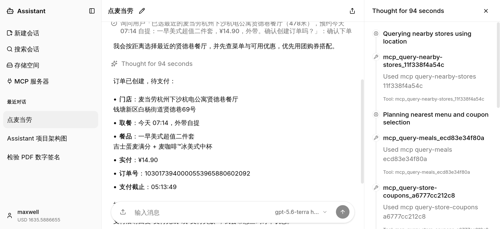
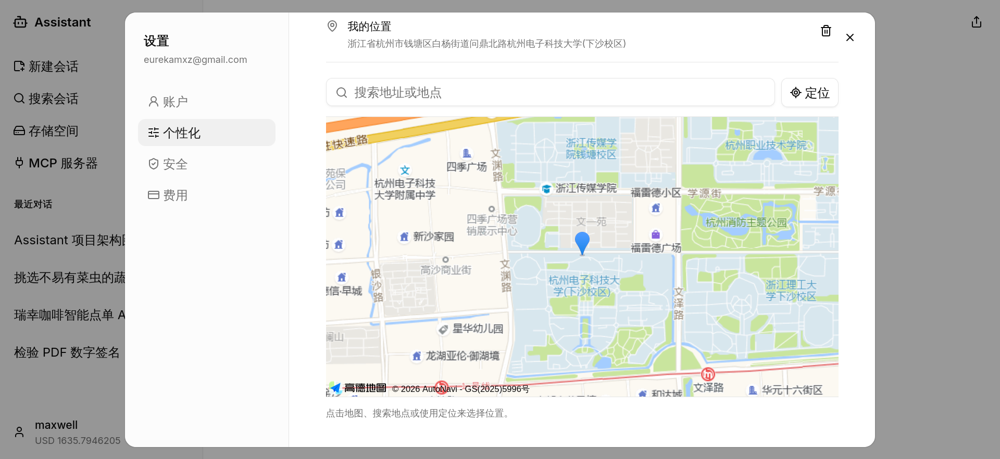
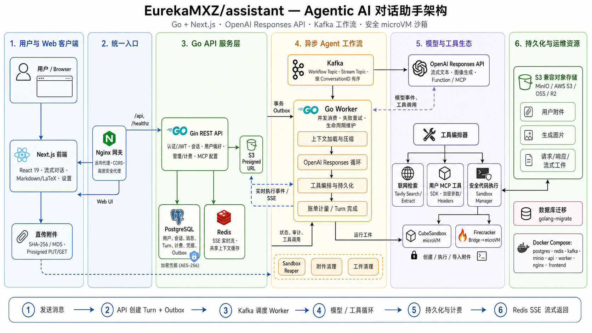

# assistant

Agentic AI 对话助手，基于 OpenAI Responses API，支持联网检索、文件理解、图片生成、用户自定义 MCP 工具，以及基于 microVM 沙箱的不受信任命令安全执行；内置个性化设置（文本偏好、位置）与用量计费（余额、资金流水、逐次请求用量明细）。

## 功能展示

点击截图可查看原图。

<table>
  <tr>
    <td width="50%" valign="top">
      <a href="./assets/websearch.png">
        
      </a>
      <br />
      <strong>联网检索与执行时间线</strong>
      <br />
      <sub>对话中持续反馈检索进度，右侧面板展示检索关键词、来源与完整工具调用过程。</sub>
    </td>
    <td width="50%" valign="top">
      <a href="./assets/billing.png">
        
      </a>
      <br />
      <strong>用量与计费</strong>
      <br />
      <sub>查看账户余额、资金流水与逐次请求的模型和工具用量明细。</sub>
    </td>
  </tr>
  <tr>
    <td width="50%" valign="top">
      <a href="./assets/mcp.png">
        
      </a>
      <br />
      <strong>用户自定义 MCP</strong>
      <br />
      <sub>接入自己的 MCP 服务器，模型按任务调用自定义工具完成真实业务操作。</sub>
    </td>
    <td width="50%" valign="top">
      <a href="./assets/personalization.png">
        
      </a>
      <br />
      <strong>个性化设置</strong>
      <br />
      <sub>文本偏好与"我的位置"，基于高德地图搜索、定位与选点。</sub>
    </td>
  </tr>
  <tr>
    <td colspan="2" align="center" valign="top">
      <a href="./assets/sandbox.png">
        
      </a>
      <br />
      <strong>隔离沙箱执行</strong>
      <br />
      <sub>在 microVM 沙箱中执行不受信任命令，附件按需导入，命令与输出全程可见。</sub>
    </td>
  </tr>
</table>

## 架构



技术栈：Go（Gin API + Worker）· Next.js（React 19）· Kafka 异步工作流 · PostgreSQL / Redis / S3 兼容对象存储 · Firecracker / CubeSandbox microVM 沙箱。

### 项目目录结构

```text
├── cmd/                    # 可执行程序入口
│   ├── api/                # Gin REST API 服务器
│   ├── worker/             # Kafka 消费者，执行模型/工具循环
│   ├── backend/            # 合并后端进程（API + Worker）
│   ├── migrate/            # 数据库迁移工具
│   ├── firecracker-bridge/ # 宿主机 Firecracker 沙箱桥接服务
│   ├── sandbox-agent/      # 沙箱 guest 内代理（附件写入等）
│   └── password-hash/      # 密码哈希工具
├── internal/               # Go 业务包（auth、billing、sandbox、worker、llm 等）
├── frontend/               # Next.js 前端（React 19）
├── db/migrations/          # SQL 迁移文件
├── deploy/nginx/           # Nginx 网关配置
├── prompts/                # 系统提示词与上下文压缩提示词
├── docs/                   # API 文档等
├── assets/                 # README 截图
├── docker-compose.yml      # 单机部署
└── docker-compose.dev.yml  # 本地开发基础设施
```

## 部署

### Docker Compose 单机部署

```bash
cp .env.example .env
# 编辑 .env：
#   - 配置认证、存储和 agent 提示词参数
#   - 生产环境必须将 WEB_ORIGIN 设置为实际访问的 HTTPS 地址
#   - 生成 provider credential 主密钥：openssl rand -base64 32
#     写入 PROVIDER_CREDENTIAL_MASTER_KEY，部署后保持不变

docker compose up -d
```

默认启动 `postgres`、`redis`、`kafka`、`minio`、`migrate`、`api`、`worker`、`nginx`、`frontend`，浏览器访问 `http://localhost:8080`（端口由 `NGINX_HOST_PORT` 控制）。镜像默认从 GHCR 拉取，可用 `ASSISTANT_IMAGE_PREFIX` / `ASSISTANT_IMAGE_TAG` 覆盖。

启动后通过系统管理界面创建 provider credential、模型和已发布价格，并设置默认模型。

### 高德地图（用户位置设置）

个性化设置中的地图使用高德 Web JS API 2.0，需在 `.env` 配置两个 Key：

- `AMAP_JS_KEY`：公开 Web Key。Compose 启动 frontend 容器时注入，Next.js 通过 `/runtime-config.js` 在运行时提供给浏览器，因此同一 GHCR 镜像可用于不同部署；修改后重启 frontend 容器即可，无需重建镜像。
- `AMAP_SECURITY_JS_CODE`：安全密钥。Compose 只传给 Nginx，用于启动时渲染 `/_AMapService` 代理，不会进入前端或镜像层；未设置时代理返回 `503`。

未配置时地图、搜索和定位不可用，文本偏好与已保存位置的文本展示不受影响。

### 本地开发

```bash
docker compose -f docker-compose.dev.yml up -d   # 基础设施 + Nginx
go run ./cmd/migrate up                          # 数据库迁移
go run ./cmd/api                                 # API 服务器 :8080
go run ./cmd/worker                              # 另一个终端
cd frontend && pnpm install && pnpm dev          # 前端 :3000
```

### 沙箱（可选）

沙箱执行默认关闭（`SANDBOX_EXEC_ENABLED=false`），不启用不影响其他功能。启用后通过 `SANDBOX_PROVIDER` 选择 `cubesandbox` 或 `firecracker`。切换 provider 只影响新建沙箱：旧 provider 的配置必须保留到旧沙箱全部进入 `destroyed` 后才能移除。

#### 如何选择

| | CubeSandbox（推荐） | Firecracker bridge |
| --- | --- | --- |
| 适用场景 | **云服务器**、较大并发 | 开发测试、小规模自用 |
| 部署形态 | 独立集群（控制面 + 计算节点） | 与宿主机同机的单个特权进程 |
| 启动方式 | 模板快照热启动 | 每次冷启动 |
| 前置条件 | 任意 x86_64 Linux 机器，可以不具备嵌套虚拟化能力，但**要求配备了 PVM 内核** | 任意拥有嵌套虚拟化能力的 Linux 机器，不需要自行定制内核，但要安装 KVM 模块 |

#### CubeSandbox（推荐，当前适配 v0.5.1）

1. **安装集群**：按官方[快速开始](https://github.com/TencentCloud/CubeSandbox/blob/v0.5.1/docs/zh/guide/quickstart.md)完成部署——准备一台 x86_64 服务器（普通云服务器即可，无需 `/dev/kvm`）、安装 PVM 宿主内核并重启、一键安装 CubeSandbox。宿主机已提供原生 `/dev/kvm` 时（物理机/裸金属）优先使用原生 KVM，改按[裸金属部署](https://github.com/TencentCloud/CubeSandbox/blob/v0.5.1/docs/zh/guide/bare-metal-deploy.md)。
2. **创建沙箱模板**：按[模板概览](https://github.com/TencentCloud/CubeSandbox/blob/v0.5.1/docs/zh/guide/templates.md)与[从 OCI 镜像制作模板](https://github.com/TencentCloud/CubeSandbox/blob/v0.5.1/docs/zh/guide/tutorials/template-from-image.md)，使用 `cubemastercli tpl create-from-image` 构建。Assistant 要求模板包含 envd 和 `/workspace` 且进入 `READY`，将返回的 `template_id` 写入 `SANDBOX_CUBE_TEMPLATE_ID`。
3. **配置网络隔离与防火墙**：
   - **控制面**：按[网络加固](https://github.com/TencentCloud/CubeSandbox/blob/v0.5.1/docs/zh/guide/network-hardening.md)收紧绑定地址与防火墙——CubeAPI、CubeMaster、Cubelet、MySQL、Redis、WebUI 放在私网，CubeAPI 启用 `AUTH_CALLBACK_URL` 鉴权，CubeProxy 只允许 API/Worker 访问。
   - **沙箱出网**：默认 `SANDBOX_CUBE_ALLOW_INTERNET=false` 且 `SANDBOX_CUBE_DENY_OUT=0.0.0.0/0`，沙箱无法访问任何外部地址；按需用 `SANDBOX_CUBE_ALLOW_OUT` 放行指定域名或 CIDR。需要按域名过滤、向请求注入凭证或审计每个请求时，使用 CubeSandbox 自带的 CubeEgress 出网代理，见[安全代理](https://github.com/TencentCloud/CubeSandbox/blob/v0.5.1/docs/zh/guide/security-proxy.md)。

```bash
SANDBOX_PROVIDER=cubesandbox
SANDBOX_CUBE_API_URL=http://cube-api.internal:3000
SANDBOX_CUBE_API_KEY=your-private-api-key
SANDBOX_CUBE_TEMPLATE_ID=tpl-xxxxxxxx
SANDBOX_CUBE_PROXY_NODE_IP=10.0.0.12
SANDBOX_CUBE_PROXY_PORT_HTTP=80
SANDBOX_CUBE_PROXY_SCHEME=http
SANDBOX_CUBE_DOMAIN=cube.app
SANDBOX_CUBE_CLUSTER_ID=production
SANDBOX_CUBE_ALLOW_INTERNET=false
SANDBOX_CUBE_DENY_OUT=0.0.0.0/0
SANDBOX_EXEC_ENABLED=true
```

注意：初期建议将 Cubelet 的 `host.quota.paused_resource_release_ratio` 设为 `0`，保证 paused 沙箱可以恢复后删除；CubeSandbox create API 尚不支持服务端幂等键，生产环境需监控并清理响应丢失产生的孤立沙箱。

#### Firecracker（开发环境）

Firecracker bridge 是运行在宿主机上的特权进程（需要 `/dev/kvm`、TAP 设备、iptables 权限），API 与 Worker 通过 HTTP 与它通信：

首先安装 KVM 与 Firecracker。CPU 需支持并已开启硬件虚拟化（`egrep -c '(vmx|svm)' /proc/cpuinfo` 大于 0）。

Debian / Ubuntu（官方仓库没有 firecracker 包，安装 KVM 后使用官方 release 二进制）：

```bash
sudo apt update && sudo apt install -y qemu-kvm
sudo modprobe kvm kvm_intel        # AMD CPU：kvm_amd

ARCH="$(uname -m)"
VER=$(basename "$(curl -fsSLI -o /dev/null -w '%{url_effective}' https://github.com/firecracker-microvm/firecracker/releases/latest)")
curl -fsSL -o /tmp/firecracker.tgz "https://github.com/firecracker-microvm/firecracker/releases/download/${VER}/firecracker-${VER}-${ARCH}.tgz"
tar -xzf /tmp/firecracker.tgz -C /tmp
sudo install -m 0755 "/tmp/release-${VER}-${ARCH}/firecracker-${VER}-${ARCH}" /usr/local/bin/firecracker
```

Fedora（官方仓库收录 firecracker）：

```bash
sudo dnf install -y firecracker qemu-kvm
sudo modprobe kvm kvm_intel        # AMD CPU：kvm_amd
```

Arch Linux（firecracker 位于 extra 仓库）：

```bash
sudo pacman -S --needed firecracker qemu-base
sudo modprobe kvm-intel            # AMD CPU：kvm-amd
```

安装后验证：

```bash
lsmod | grep kvm                                   # kvm 模块已加载
[ -r /dev/kvm ] && [ -w /dev/kvm ] && echo OK      # /dev/kvm 可读写
# bridge 以 root 运行时无需额外授权；非 root 运行时执行
# sudo usermod -aG kvm $USER 并重新登录
```

然后启动 bridge 并配置 API / Worker：

```bash
# 1. 准备 Firecracker 内核与 rootfs 镜像；rootfs 必须内置与当前代码
#    一同构建的 sandbox-agent（提供附件写入端点）
# 2. 启动 bridge
export FIRECRACKER_BIN=firecracker
export FIRECRACKER_KERNEL_IMAGE=/path/to/vmlinux
export FIRECRACKER_ROOTFS_IMAGE=/path/to/rootfs.ext4
export FIRECRACKER_BRIDGE_ADDR=127.0.0.1:8787
export FIRECRACKER_BRIDGE_TOKEN=your-secret-token   # 可选
go run ./cmd/firecracker-bridge

# 3. 在 .env 中配置 API / Worker 使用 bridge
SANDBOX_PROVIDER=firecracker
SANDBOX_BRIDGE_URL=http://host.docker.internal:8787
SANDBOX_BRIDGE_TOKEN=your-secret-token
SANDBOX_EXEC_ENABLED=true
```

网络隔离：默认 `FIRECRACKER_NET_ENABLED=false`，guest 完全没有网络，隔离最强。设置为 `true` 后 bridge 会在宿主机创建网桥 `fcbr0`（默认 `172.16.0.0/24`），为 guest 分配 TAP 设备并开启 `ip_forward` 与 MASQUERADE，guest 经宿主机 NAT 出网；可用宿主机 iptables 自行限制 guest 出方向。

沙箱生命周期（两种 provider 通用）：空闲 `SANDBOX_IDLE_STOP_AFTER`（默认 `15m`）后自动停止，停止超过 `SANDBOX_STOPPED_RETENTION`（默认 `24h`）后释放销毁，详见 `.env.example` 中 `SANDBOX_*`。

更详细的环境变量说明见 `.env.example`，API 文档见 [docs/API.md](./docs/API.md)。

## 开源协议

本项目基于 [Apache License 2.0](LICENSE) 开源。
